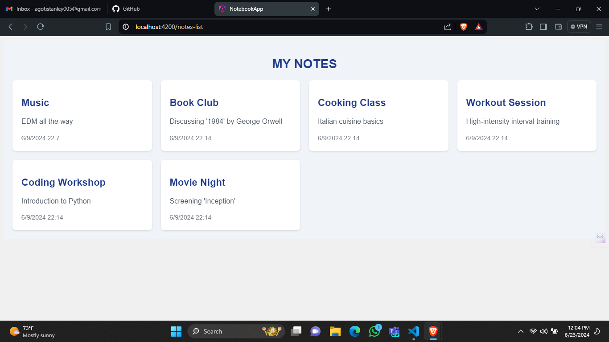
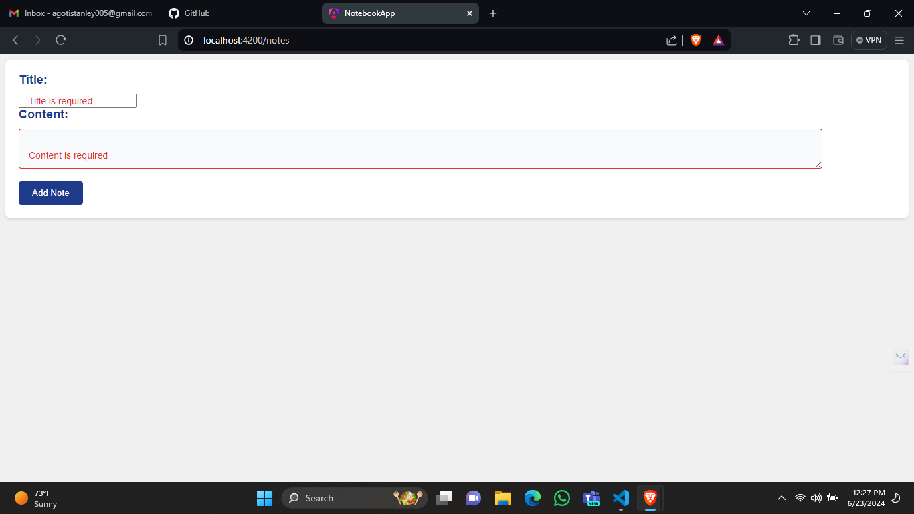

# Notes API Documentation

This API allows you to manage notes. Here are the available endpoints:

## Get All Notes

To retrieve all notes, send a GET request to:

`GET http://localhost:4000/api/notes`



## Get One Note

To retrieve a specific note by its ID, send a GET request to:


`GET http://localhost:4000/api/notes/{id}`


Replace `{id}` with the ID of the note you want to retrieve.

## Add a New Note

To add a new note, send a POST request to:

```
POST http://localhost:4000/api/notes 
Content-Type: application/json

{ 
  "title": "Music night", 
  "content": "EDM all the way" 
}
```

## Update a Note

To update a specific note by its ID, send a PUT request to:

```
PUT http://localhost:4000/api/notes/{id} 
Content-Type: application/json

{ 
  "title": "Music", 
  "content": "EDM all the way" 
}
```

Replace `{id}` with the ID of the note you want to update.

## Delete a Note

To delete a specific note by its ID, send a DELETE request to:


`DELETE http://localhost:4000/api/notes/{id}`
